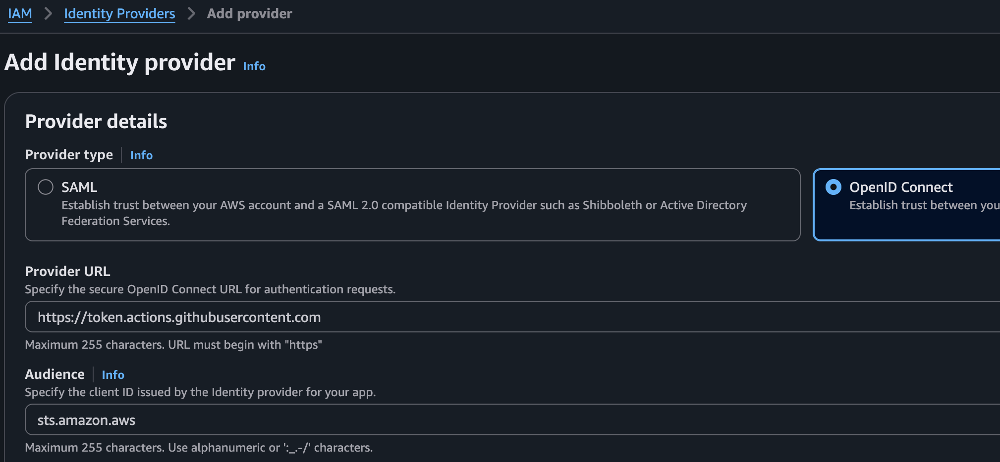
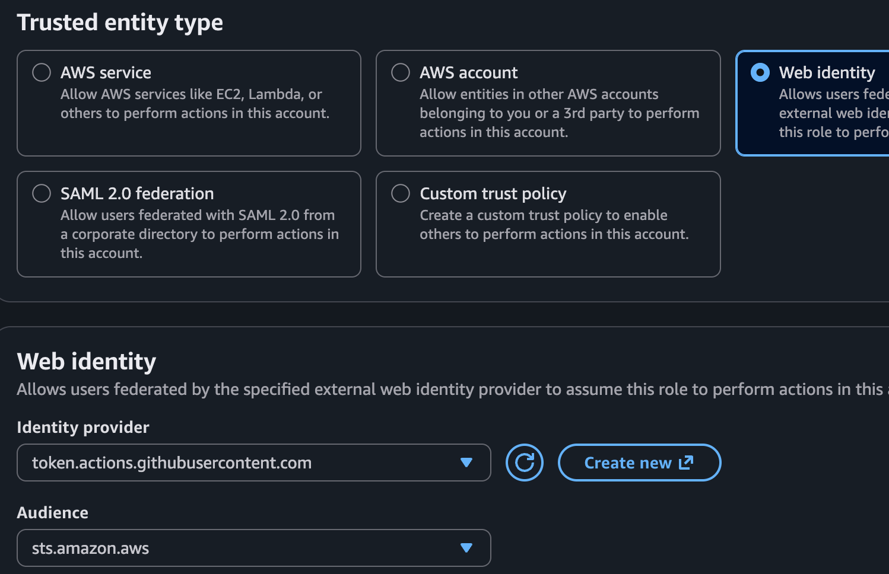

## AWS OpenID Connect 
### Connect Github actions to AWS via openid connect
https://docs.github.com/en/actions/how-tos/secure-your-work/security-harden-deployments/oidc-in-aws

IAM -> Identity Providers -> Add provider  
OpenID Connect -> Provider URL: https://token.actions.githubusercontent.com
  


  
Next, create a new role:


Skip Add permissions  

Trust policy:
```
{
    "Version": "2012-10-17",
    "Statement": [
        {
            "Effect": "Allow",
            "Principal": {
                "Federated": "arn:aws:iam::274755515534:oidc-provider/token.actions.githubusercontent.com"
            },
            "Action": "sts:AssumeRoleWithWebIdentity",
            "Condition": {
                "StringEquals": {
                    "token.actions.githubusercontent.com:aud": "sts.amazon.aws"
                },
                "StringLike": {
                    "token.actions.githubusercontent.com:sub": "repo:jlimkw/*"
                }
            }
        }
    ]
}
```